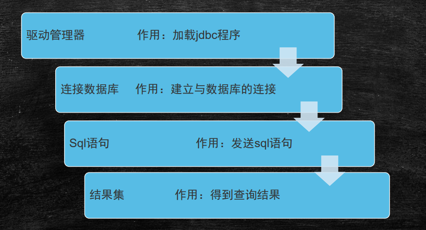

#JDBC

## JDBC介绍 

 JDBC(Java Database Connectivity)是基于JAVA语言访问数据库的一种技术。 

JDBC（Java Data Base Connectivity,java数据库连接）是一种用于执行SQL语句的Java API，可以为多种关系数据库提 供统一访问，它由一组用Java语言编写的类和接口组成。JDBC提供了一种基准，据此可以构建更高级的工具和接口，使 数据库开发人员能够编写数据库应用程序，同时，JDBC也是个商标名。 

JDBC的设计思想：由SUN公司(JCP)提供访问数据库的接口，由数据库厂商提供对这些接口的实现，程序员编程时都是 针对接口进行编程的。 

JDBC包括一套JDBC的API和一套程序员和数据库厂商都必须去遵守的规范。 

- java.sql包：提供访问数据库基本的功能 
- javax.sql包：提供扩展的功能 

数据库中间件 

JDBC可以做些什么？ 

- 连接到数据库 
- 在Java app中执行SQL命令 
- 处理结果。

jdbc

- Java反问控制数据库里面数据的一套标准     接口
- Java  面向对象编程    -- 面向接口编程

职责

1. java客户端：接收数据、拼接sql 、发送sql、分析结果、返 回结果browser
2. db服务器：接收sql, 分析处理，返回结果给java

### java.sql

1、java.sql.Driver : -->驱动 

2、java.sql.Connection -->连接 

3、java.sql.Statement -->静态处理

​			java.sql.PreparedStatement -->预处理块 

4、java.sql.ResultSet -->结果集 

5、java.sql.ResultSetMetaData -->结果集元数据

### 常用接口

Java.sql.DriverManager用来装载驱动程序，并且为创建新 的数据库联接提供支持。 

▪ Java.sql.Connection完成对某一指定数据库的联接 

▪ Java.sql.Statement在一个给定的连接中作为SQL执行声明 的容器，他包含了两个重要的子类型。 

​	– Java.sql.PreparedSatement用于执行预编译的sql声明 

​	– Java.sql.CallableStatement用于执行数据库中存储过程的调用

 ▪ Java.sql.ResultSet对于给定声明取得结果的途径