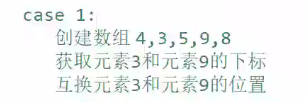
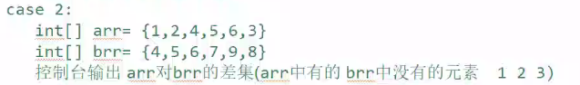
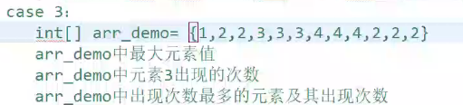
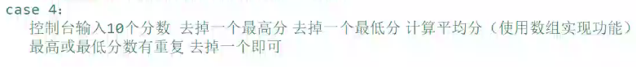
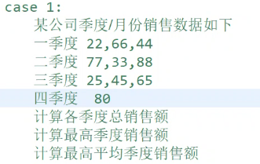
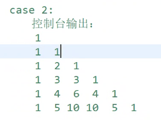
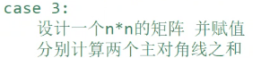

# java笔记Day2

## 一.数组

## 1.1定义：

存放相同数据类型的容器  Array   定长

## 1.2声明：

```java
//数据类型[] 数组名    推荐上面
int[] arr_01;
//数据类型 数组名[]
int arr_02[];
```


## 1.3 初始化：

mehtod 1：

```java
//数据类型[] 数组名 = new 数据类型[长度]
//数组名[下标、角标、序列]=值
```

method 2：

```java
//数据类型[] 数组名 = new int[]{2,3,7,3,4,5}
```

method 3:

```java
//数据类型[] 数组名 = {2,3,7,3,4,5}
```

采用缺省的写法


## 1.4  遍历

1.下标遍历：将下标作为循环变量  从0  循环值  数组长度-1

2.foreach遍历：

```java
//for(数据类型 变量名：数组名){
//    变量名
//}
```


3.使用场景：

创建时 已知数组元素内容  使用 method 2/3   否则  使用 1

遍历时 下标循环 可以控制获取数组中 指定位置元素 / foreach 只能对数组全部元素做处理


## 二.练习

### case 1



```java
package Day2;

public class case1 {
	public static void main(String[] args) {
		int[] arr = {4,3,5,9,8};
		int m =-1;
		int n =-1;
		for(int i = 0;i<arr.length;i++) {
			if(arr[i]==3) {
				m = i;
				System.out.println("元素3的小标是"+m);
				continue;
			}
			if(arr[i]==9) {
				n = i;
				System.out.println("元素9的小标是"+n);
			}
		}
		System.out.println("原数组为");
		for(int i:arr) {
			System.out.print(i+" ");
		}
		arr[m] = arr[m] ^ arr[n];
		arr[n] = arr[m] ^ arr[n];
		arr[m] = arr[m] ^ arr[n];
		System.out.println();
		for(int i:arr) {
			System.out.print(i+" ");
		}
	}
}

```

结果

```java
元素3的小标是1
元素9的小标是3
原数组为
4 3 5 9 8 
4 9 5 3 8 
```


### case 2



```java
package Day2;
public class case2 {
	public static void main(String[] args) {
		int[] arr = {1,2,4,5,6,3};
		int[] brr = {4,5,6,7,9,8};
		int count=0;
		System.out.print("差集为[");
		for (int i = 0; i < arr.length; i++) {
			for (int j = 0; j < brr.length; j++) {
				if(arr[i]!=brr[j]) {
					count++;
				}
			}
			if(count==brr.length) {
				System.out.print(arr[i]+" ");
			}
			count=0;
		}
		System.out.print("]");
	}
}

```

结果

```java
差集为[1 2 3 ]
```


### case 3




```java
package Day2;

public class case3 {
	public static void main(String[] args) {
		int[] arr_demo= {1,2,2,3,3,3,4,4,4,2,2,2};
		int max=arr_demo[0];
		int count = 0;
		int maxCount_k = arr_demo[0];
		int maxCount_v = 0;
		int temp = 0;
		for (int i = 0; i < arr_demo.length; i++) {
			if(max<arr_demo[i]) {
				max=arr_demo[i];
			}
		}
		System.out.println("数组最大值为："+max);
		
		for (int i = 0; i < arr_demo.length; i++) {
			if(arr_demo[i]==3) {
				count++;
			}
		}
		System.out.println("3出现的次数为："+count);
		
		for (int i = 0; i < arr_demo.length; i++) {
			for (int j = 0; j < arr_demo.length; j++) {
				if(arr_demo[i]==arr_demo[j]) {
					temp++;
				}
			}
			if(temp>maxCount_v) {
				maxCount_v=temp;
				maxCount_k=arr_demo[i];
			}
			temp=0;
			
		}
		System.out.println("出现最多次的元素为："+maxCount_k+"次数为:"+maxCount_v);
	}
}
```

结果

```java
数组最大值为：4
3出现的次数为：3
出现最多次的元素为：2次数为:5
```

### case 4




```java
package Day2;

import java.util.Scanner;

public class case4 {
	public static void main(String[] args) {
		Scanner sc = new Scanner(System.in);
		int[] arr = new int[10];
		double sum = 0;
		double p = 0;
		for (int i = 0; i < 10; i++) {
			arr[i]=sc.nextInt();
		}
		int max = arr[0];
		int min = arr[0];
		for (int i = 0; i < arr.length; i++) {
			if(max<arr[i]) {
				max=arr[i];
			}
			if(min>arr[i]) {
				min=arr[i];
			}
			sum+=arr[i];
		}
		sum=sum-max-min;
		p=sum/(arr.length-2);
		System.out.println("去掉一个最高分："+max+"分,去掉一个最低分："+min+"分，最后平均数为："+p+"分");
	}
}
```


结果

```java
1 2 3 4 5 6 7 8 9 9 
去掉一个最高分：9分,去掉一个最低分：1分，最后平均数为：5.5分
```


### 附加题：约瑟夫环

```java
package Day2;
import java.util.Arrays;
import java.util.Scanner;
public class extra {
	public static void main(String[] args) {
		Scanner sc = new Scanner(System.in);
		System.out.println("请输入人数");
		int count = sc.nextInt();
		int[] arr = new int[count];
		int i = 0;
		int flag = 0;
		int m =arr.length;
		while(m!=1) {
			if(arr[flag]!=1) {
				if((i+1)%3==0) {
					arr[flag]=1;
					m--;
					System.out.println("第"+(flag+1)+"个人淘汰"+Arrays.toString(arr));
				}
				i++;
				i%=3;
			}
			flag++;
			flag%=arr.length;
		}
		for (int j = 0; j < arr.length; j++) {
			if(arr[j]==0) {
				System.out.println(j+1);
			}
		}
	}
}

```

结果

```java
请输入人数
10
第3个人淘汰[0, 0, 1, 0, 0, 0, 0, 0, 0, 0]
第6个人淘汰[0, 0, 1, 0, 0, 1, 0, 0, 0, 0]
第9个人淘汰[0, 0, 1, 0, 0, 1, 0, 0, 1, 0]
第2个人淘汰[0, 1, 1, 0, 0, 1, 0, 0, 1, 0]
第7个人淘汰[0, 1, 1, 0, 0, 1, 1, 0, 1, 0]
第1个人淘汰[1, 1, 1, 0, 0, 1, 1, 0, 1, 0]
第8个人淘汰[1, 1, 1, 0, 0, 1, 1, 1, 1, 0]
第5个人淘汰[1, 1, 1, 0, 1, 1, 1, 1, 1, 0]
第10个人淘汰[1, 1, 1, 0, 1, 1, 1, 1, 1, 1]
4
```


## 三.二维数组

以数组为元素的数组

int[][] tow_dim_arr = new int\[ 3 ][ 2 ]

Arrays.deepToString()   打印

## 三.练习

### case 1




```java
public class case5 {
	public static void main(String[] args) {
		int[][] arr = {{22,66,44},
						{77,33,88},
						{25,45,65},
						{80}};
		int sum = 0;
		int temp = 0;
		int max = 0;
		int max_p = 0;
		for (int i = 0; i < arr.length; i++) {
			for (int j = 0; j < arr[i].length; j++) {
				temp+=arr[i][j];
			}
			System.out.println("第"+(i+1)+"季度销售总额为"+temp);
			if(max<temp) {
				max=temp;
			}
			if((temp/arr[i].length)>max_p) {
				max_p=temp/arr[i].length;
			}
			sum+=temp;
			temp=0;
		}
		System.out.println("最高季度销售额为"+max);
		System.out.println("最高平均季度销售额为"+max_p);
	}
}
```

结果

```java
第1季度销售总额为132
第2季度销售总额为198
第3季度销售总额为135
第4季度销售总额为80
最高季度销售额为198
最高平均季度销售额为80
```


### case 2  杨辉三角



```java
public class case6 {
	public static void main(String[] args) {
        int row = 7;
        int[][] arr = new int[row][row];
        for (int i = 0; i < row; i++){
            for(int j = 0;j<= i;j++){
                if (j==0 || j==i){
                    arr[i][j]=1;
                }else{
                    arr[i][j]=arr[i-1][j-1]+arr[i-1][j];
                }
                System.out.print(arr[i][j]+" ");
            }
            System.out.println();
        } 
	}
}

```

结果

```java
1 
1 1 
1 2 1 
1 3 3 1 
1 4 6 4 1 
1 5 10 10 5 1 
1 6 15 20 15 6 1 
```


### case 3



```java
import java.util.Arrays;
import java.util.Scanner;

public class case7 {
	public static void main(String[] args) {
		Scanner sc = new Scanner(System.in);
		System.out.println("输出矩阵大小");
		int n = sc.nextInt();
		int[][] arr = new int[n][n];
		int sum1 = 0;
		int sum2 = 0;
		for (int i = 0; i < arr.length; i++) {
			for (int j = 0; j < arr[i].length; j++) {
				arr[i][j] = (int)(Math.random()*10);
			}
			System.out.println(Arrays.toString(arr[i]));
		}
		for (int i = 0; i < arr.length; i++) {
			for (int j = 0; j < arr[i].length; j++) {
				if(i==j) {
					sum1+=arr[i][j];
				}
				if(i==(n-j-1)) {
					sum2+=arr[i][j];
				}
			}
			
		}
		System.out.println(sum1+" "+sum2);
	}
}
```

结果

```java
输出矩阵大小
6
[1, 6, 6, 7, 1, 4]
[3, 4, 5, 2, 3, 0]
[2, 2, 6, 2, 0, 8]
[5, 7, 3, 4, 5, 2]
[2, 7, 0, 7, 7, 8]
[7, 9, 3, 3, 9, 7]
29 26
```

